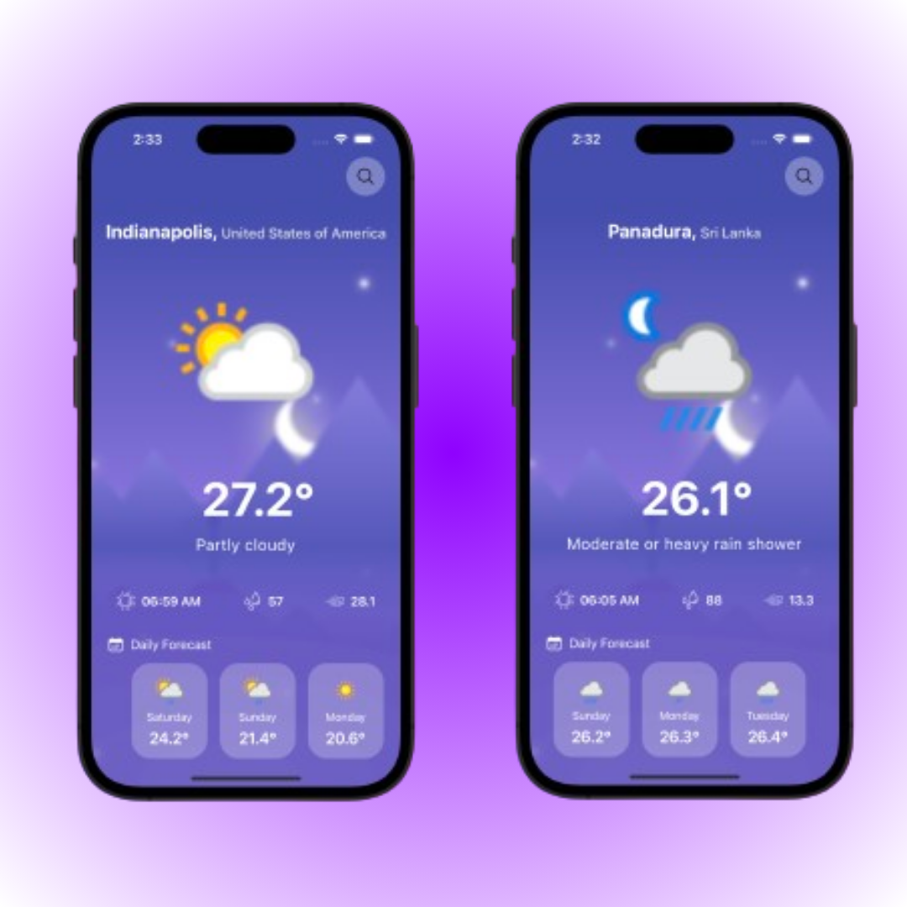

# Weather App

A weather app built with React Native Expo, featuring a modern design using React Hero Icons, NativeWind/TailwindCSS, and integrated with an online weather API. This app provides current weather information and forecasts with a clean, responsive UI.

## Features

- **Current Weather**: Displays the current weather for any location.
- **Weather Forecast**: Provides a forecast for the next few days.
- **AsyncStorage**: Saves user preferences and locations for quick access.
- **Responsive Design**: Built with NativeWind/TailwindCSS for a modern and flexible layout.
- **Hero Icons**: Utilizes React Hero Icons for an aesthetically pleasing UI.

## Tech Stack

- **React Native Expo**: Framework for building the app.
- **React Hero Icons**: Icon library used in the app.
- **Online Weather API**: Provides weather data.
- **AsyncStorage**: Manages persistent data storage.
- **NativeWind/TailwindCSS**: Styling framework for the app.